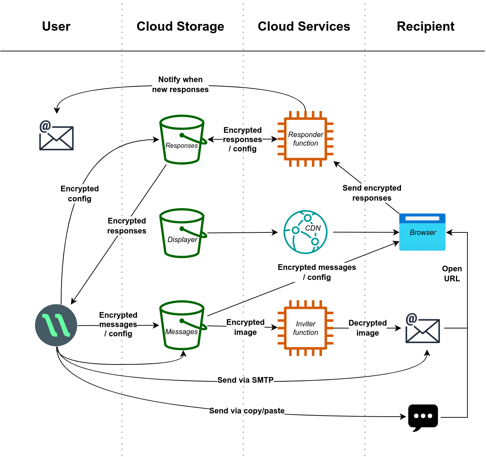

# στέλλω

This is the source code for [Stello](https://stello.news), a cross-platform app for sending secure and interactive newsletters. Stello is freely given under the MIT No Attribution license.

&nbsp;

## Components

 - **app:** Base for main application
    - Contains all the UI and functionality for senders of messages
    - Written in Typescript with Vue 2
 - **electron:** Desktop integration for app
    - Provides for desktop everything not possible in app base (such as SMTP and file system access)
    - Written in Typescript
 - **displayer:** The webpage served whenever opening a message
    - Responsible for downloading, decrypting, and displaying messages
    - Written in Typescript with Vue 3
 - **responder:** Cloud function that handles responses from readers
    - Processes and stores encrypted responses, and notifies the sender
    - Written in Python (so far for AWS only)
 - **host:** Cloud services for non-self-hosted Stello accounts
    - Sets up AWS services for registration, authentication, storage, etc
    - Written as an AWS Serverless template

## Browser support

The displayer of messages currently supports all browsers that have implemented the Subtle Crypto API, as well as all ES2015 features, Content Security Policy 2, and CSS grid (since most have when crypto supported).

 - Chrome 57+
 - Edge 79+
 - Samusung 6.2+
 - Safari 10.1+
 - iOS 10.3+
 - Firefox 54+

Notes:
* Supports around 95% of users (Apr 2021)
* [webkitSubtle is not compatible](https://webkit.org/blog/7790/update-on-web-cryptography/)

&nbsp;

# How Stello works
In brief, Stello works by uploading static encrypted messages to buckets which are downloaded and decrypted in-browser by recipients.

Please first read the high-level overviews of [how Stello works](https://stello.news/guide/system/) and its [security system](https://stello.news/guide/security/) in the Stello Guide. The following expands on those in more detail.

## Infrastructure

Stello uses simple file storage via buckets (rather than a database) and two simple cloud functions (rather than a server). All the encryption and decryption takes place in the Stello app and in the browser of the recipient.

As you can see from the diagram, messages are encrypted before leaving the app and only decrypted once they reach the recipient's browser (i.e. end-to-end), and responses are encrypted in the recipient's browser and only decrypted once downloaded by the app.

<small>The one exception is invitation images which are decrypted by the Inviter function, since email clients are less sophisticated than browsers and unable to do the decryption themselves. The decryption key is only used for the images and is not the same as the one used for messages, and is provided via the request URL and not stored after serving the image.</small>

### Differences between hosting environments
 * When self-hosting the displayer will be stored in the messages bucket rather than having its own, and a CDN is not required
 * When self-hosting the user will have their own buckets and functions, whereas when Gracious Tech hosts the buckets and functions are shared by all users
 * Self-hosting users get their own IAM key whereas Gracious Tech users get credentials via AWS Cognito for the sake of scaling
 * In AWS (currently the only option) it also requires an API Gateway for public access to the AWS lambda functions, though this may not be required in other cloud environments if functions can be executed without credentials

### The role of the CDN

In the non-self-hosted setup a CDN is required to:
 * Allow custom domain names with HTTPS
 * Allow each user to have their own subdomain

The CDN is configured to serve the same files (the displayer) for every subdomain, and the displayer is configured to use the subdomain it is hosted on as the prefix for the URL the messages are fetched from. This means that despite the displayer being static files served from the same bucket it will still have a unique origin per user (for browser storage), preventing accessing message keys (stored in browser) across subdomains or across subdirectories of the messages bucket.

## Accounts ([view source](host/accounts/src/handle_create.ts))
Self-hosting users are granted full permissions for all the resources that belong to them where as Gracious Tech users are only granted permissions they currently need and cannot access bucket subdirectories of other users.

Gracious Tech hosting stores the following information about users:
 * Username
 * Hashed email address
 * Hashed IP address
 * Plan (currently two options, both free)

Stello auto-generates a password for Gracious Tech users and stores it internally. There is no account recovery, only account deletion, so if the user loses access to Stello's data (e.g. loses computer) then they cannot recover their account and can only request that it be deleted.

Because the email address is hashed the user cannot be contacted unless they initiate contact and their address is matched with the hash, and therefore stay anonymous unless they choose to initiate contact.

## Config ([view source](app/src/services/tasks/configs.ts))
When a Stello account is created or updated, config files will be uploaded to both the messages bucket (for displayer to access) and responses bucket (for responder function to access).

Sensitive data includes:
 - User's email address (so responder can send notifications)
 - Public key for encrypting responses

Config files are encrypted with a key that is included in every message URL. The displayer uses this key to decrypt the displayer's config and it also passes the key onto the responder when sending responses so it can in turn decrypt the responder's config. This ensures the contents of config files is protected while in storage and the key is never stored in cloud services and only temporarily available in memory.

## Sending ([view source](app/src/services/tasks/sending.ts))
For every message that is sent, a unique copy with a unique key is created for every recipient and the key is never reused. The entire contents of the message is included in every copy except for some large assets (like images and files) which are encrypted using a key that is shared with all copies.

Symmetric encryption is used and the key is included in the fragment identifier of the URL which takes the form:

    https://storage/#config_secret,copy_id,secret

Since the fragment identifier is by nature of browsers never sent over HTTP the secrets are never transmitted to the server storing the encrypted messages.

## Viewing ([view source](displayer/src/services/store.ts))
The displayer component of Stello is a webpage that examines the fragment identifier, fetches the message identified in it, and decrypts it with the secret which is also included in the fragment identifier. It then displays the message by rendering it as HTML.

It does all of this via JavaScript with nothing done server-side.

## Responding ([view source](displayer/src/services/responses.ts))
Responses are encrypted using the public key stored in the config file. Some data is not encrypted when it is needed by the responder function (such as to expire a message it needs to know its id).

<small>Users can optionally configure responses to be sent unencrypted to the responder function so that the contents can be sent in notification emails, but the contents is then still encrypted before being stored in the responses bucket.</small>

Responses are not able to be kept by the person responding and are lost to them once the browser session ends, so that the Stello user has complete control of all information sent and received rather than recipients.

## Cryptography ([view source](app/src/services/utils/crypt.ts))
AES-GCM is used for symmetric encryption and RSA-OAEP is used for asymmetric encryption (in combination with AES-GCM). SHA-256 is used for hashes.

### End-to-end encryption

Stello is end-to-end encrypted in the sense that the platform that stores and transfers the actual messages never has access to the decryption key. However, we avoid describing Stello as end-to-end encrypted because there are other aspects of Stello that make it less secure than well known end-to-end encryption apps:

1. Most people use email to send Stello messages and so Stello is in many ways only as secure as the platform used to send the links to the Stello messages (though it does add expiry)
2. The decryption code is served by the server that also stores the encrypted files, such that an infiltrated server could modify the decryption code to transmit unencrypted data somewhere
    * An encrypted messaging app publishing a malicious app update would be similar to this, though harder to pull off
    * A [Content Security Policy header](host/template_base.yml) has been added to prevent the transmission of data to an external server

# Credits

Attribution for assets not already identifiable in package.json files:

 * [Animated reactions (CC BY)](https://googlefonts.github.io/noto-emoji-animation/)
